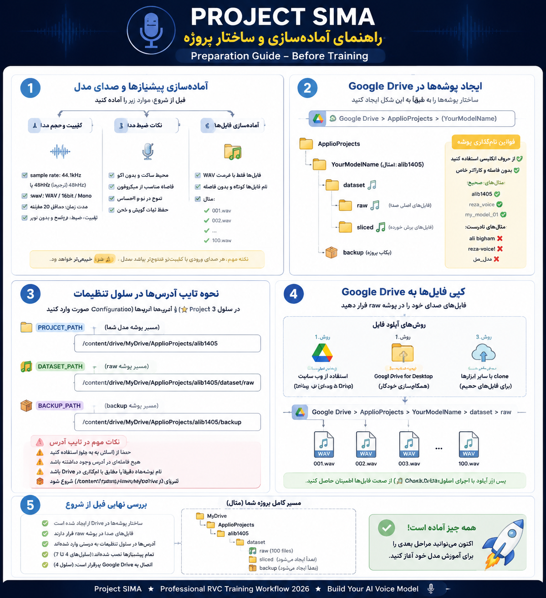
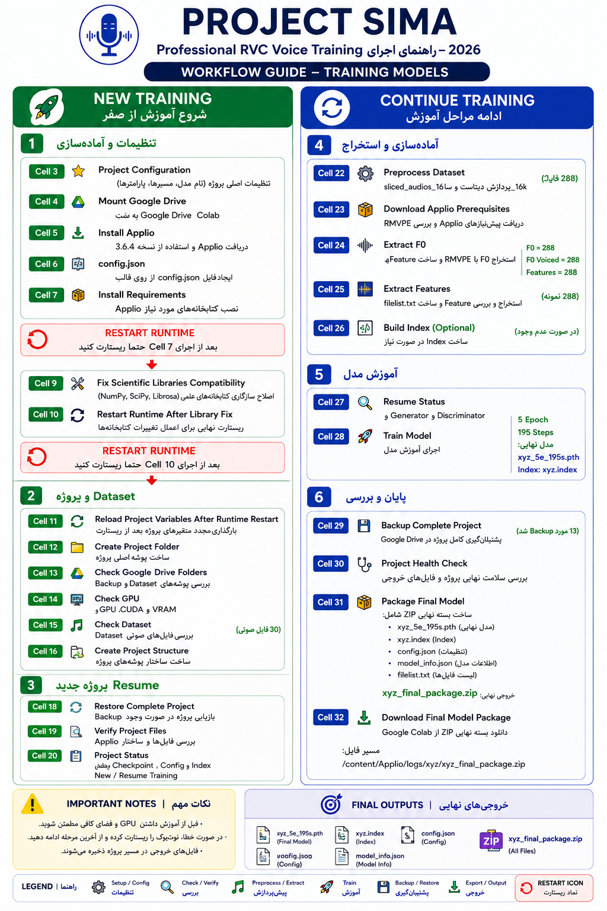

<div align="center">

# 🎤 Project SIMA

### Professional RVC Voice Training Notebook (2026)

### نوت‌بوک حرفه‌ای آموزش مدل‌های RVC

[](https://colab.research.google.com/github/alibigham57/Project-SIMA/blob/main/Applio_Master_2026_v2_14050514.ipynb)


</div>

---

# 🇺🇸 English

Project SIMA is a professional Google Colab notebook for training high-quality RVC Voice Cloning models using Applio.

Designed for beginners and advanced users with a fully automated workflow.

## Features

- ✅ One-click setup
- ✅ Google Drive Integration
- ✅ Automatic Dataset Processing
- ✅ Feature Extraction
- ✅ Resume Training
- ✅ Automatic Backup
- ✅ Automatic Restore
- ✅ Automatic Model Export (.pth)
- ✅ Automatic Index Generation (.index)
- ✅ Tesla T4 Optimized

---

# 🇮🇷 فارسی

پروژه **SIMA** یک نوت‌بوک حرفه‌ای Google Colab برای آموزش مدل‌های Voice Cloning مبتنی بر RVC و Applio است.

تمام مراحل آموزش از آماده‌سازی دیتاست تا استخراج مدل نهایی به‌صورت خودکار انجام می‌شود.

### امکانات

- ✅ نصب و راه‌اندازی خودکار
- ✅ اتصال به Google Drive
- ✅ پردازش خودکار دیتاست
- ✅ استخراج ویژگی‌ها
- ✅ ادامه آموزش (Resume)
- ✅ پشتیبان‌گیری خودکار
- ✅ استخراج خودکار مدل
- ✅ ساخت خودکار فایل Index
- ✅ بهینه‌شده برای Tesla T4

---

# 📖 Workflow Guide | راهنمای اجرا

قبل از اجرای نوت‌بوک ابتدا تصاویر زیر را مشاهده کنید.

## Step 1



---

## Step 2



---

# 🚀 Quick Start

1. Open Notebook in Google Colab.
2. Mount Google Drive.
3. Configure your dataset.
4. Run the notebook from **Cell 1**.
5. Train or Resume Training.
6. Export your model.

---

# 🚀 شروع سریع

۱- نوت‌بوک را در Google Colab باز کنید.

۲- Google Drive را Mount کنید.

۳- دیتاست را معرفی کنید.

۴- اجرای نوت‌بوک را از **Cell 1** آغاز کنید.

۵- آموزش جدید یا Resume را اجرا کنید.

۶- مدل نهایی را استخراج کنید.

---

# 📂 Repository Structure

```text
Project-SIMA
│
├── Applio_Master_2026_v2_14050514.ipynb
├── README.md
├── LICENSE
│
├── assets
│   ├── banner.png
│   ├── logo.png
│   ├── 1.png
│   └── 2.png
│
└── docs
```

---

# 📄 Final Output

✔ Voice Model (.pth)

✔ Feature Index (.index)

These two files are all you need for Voice Conversion.

---

# 📄 خروجی نهایی

✔ فایل مدل (.pth)

✔ فایل Index (.index)

برای استفاده در نوت‌بوک تغییر صدا فقط همین دو فایل کافی هستند.

---

# 📜 License

This project is released for educational and research purposes.

این پروژه برای اهداف آموزشی و پژوهشی منتشر شده است.

---

<div align="center">

## ⭐ Project SIMA

Made with ❤️ using Google Colab + Applio

2026

</div>
